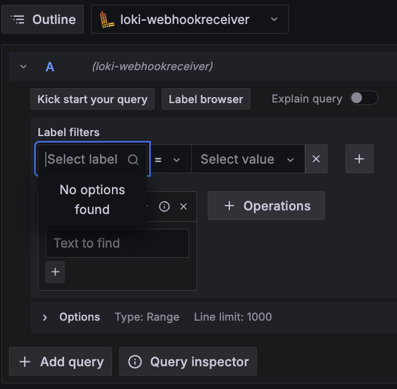

Testing whether its worth to have loki attached to a pvc.  

Reason, I dont think our query is accesses the data in the store.  
Recall...  

## Loki Read Path Overview

Here’s a simplified look at how the read path works in Loki:

1. **Receive Query:** The query frontend gets an HTTP GET request with a LogQL query. 📥
2. **Split Query:** The frontend splits the query into sub-queries. ✂️
3. **Schedule Sub-Queries:** Sub-queries are passed to the query scheduler. 🗂️
4. **Query Ingesters:** The querier retrieves sub-queries and asks ingesters for in-memory data. 💾
5. **Get Data:** Ingesters return any matching in-memory data. 🔍
6. **Load from Store:** If needed, the querier loads data from the backing store. 🏪
7. **Deduplicate Data:** The querier deduplicates the data and sends results back to the frontend. ♻️
8. **Collect Results:** The frontend waits for all sub-queries to complete. ⏳
9. **Merge Results:** The frontend merges all results and sends the final response to the client. 📨
``
-----

To test, I enable the `query_ingestor_only` value in loki-config. I hypothesize that the query speed will go down.

Request 1: 0m0.554s  
Request 2: 0m0.372s  
Request 3: 0m0.564s  
Request 4: 0m0.902s  
Request 5: 0m0.518s  
Request 6: 0m0.387s  
Request 7: 0m0.517s  
Request 8: 0m0.383s  
Request 9: 0m0.384s  
Request 10: 0m0.508s  
Average time: for "query_ingester_only.txt_timing.txt"  

-----
We see there is no change. Lets enable `query_store_only` flag and test. I hypothesize it should be a bit faster.

Request 1: 0m0.577s
Request 2: 0m0.459s
Request 3: 0m0.414s
Request 4: 0m0.403s
Request 5: 0m0.411s
Request 6: 0m0.334s
Request 7: 0m0.392s
Request 8: 0m0.422s
Request 9: 0m0.418s
Request 10: 0m0.359s
Average time: for "query_store_only.txt_timing.txt"

-----
We can see its a bit faster, but not by much. However theres a problem. In Grafana, the labels do not show up

I hypothesize that the labels are stored in-memory and thus we need to query the ingestors. Based on the performance of querying the ingestors, I believe we should go back to a `Deployment` opposed to a `Stateful Set` for three reasons:
1. The PVC's data isnt used in the essential query
2. We have to run the **seed job** <i>manually</i> at the start of every day.
3. Attaching the seed job to the deployment reduces toil.

We could just add the seeding container to the deployment to run each time the **loki pod** is rescheduled. This would mean we don't have to manually seed each day and the container would populate the data for us.

Total: 393
